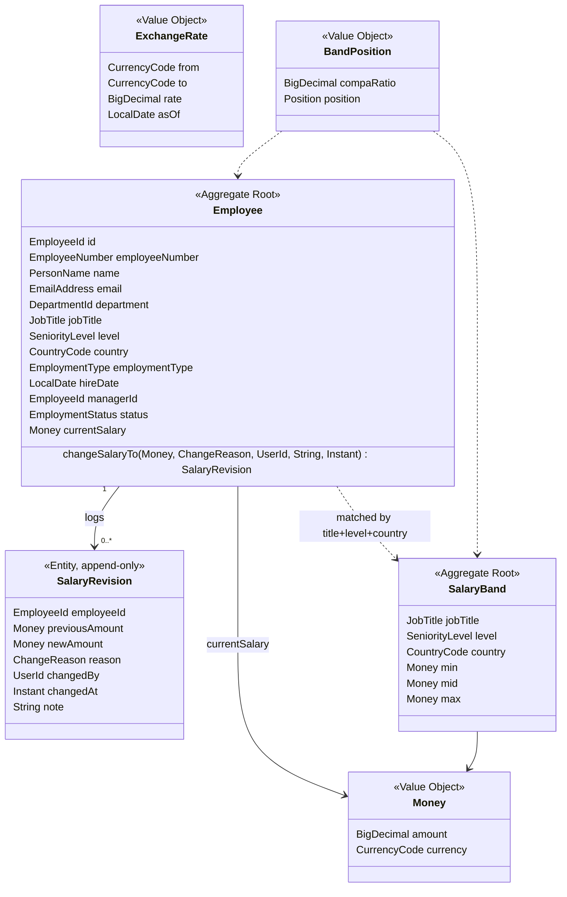

# Domain Model

Scope confirmed with Incubyte: **current salary per employee is sufficient; effective-dated history
is deferred.** The model below is deliberately smaller than the one originally designed, and
[ADR-0002](adr/0002-current-salary-with-audit-log.md) records both what was dropped and why keeping
one piece of it was still worth doing.

## 1. The shape of the decision

Two things were on the table:

- **A temporal model** — salary as an append-only set of `[effective_from, effective_to)` intervals,
  supporting retroactive corrections, future-dating and as-of queries.
- **A current-value model** — one salary per employee, updated in place.

The customer said the second is sufficient. Building the first anyway would have been the largest
component of the system, delivering capability that was explicitly declined.

So: **current value is the model.** But a salary change is still a financially significant event, and
a system that lets a number change with no record of who changed it or what it was before is not
one you would want holding your org's pay data. The middle position — and the one taken — is an
**append-only `SalaryRevision` log** written on every change. One table, one insert, no interval
arithmetic, no as-of query engine.

The distinction matters and is worth being precise about in review:

| | Audit log (built) | Temporal model (not built) |
|---|---|---|
| Answers "what changed, when, by whom" | ✅ | ✅ |
| Answers "what is this person paid" | ✅ (from `Employee`) | ✅ (interval lookup) |
| Answers "what did the org look like on a past date" | ❌ | ✅ |
| Retroactive corrections, future-dating | ❌ | ✅ |
| Cost | one table, one insert | new aggregate, interval algebra, exclusion constraints, as-of queries throughout |

## 2. Aggregates

`Employee.changeSalaryTo(...)` is the only way a salary changes. It mutates `currentSalary` **and**
returns the `SalaryRevision` to be persisted — so it is structurally impossible to change pay without
producing an audit entry. There is no public setter for `currentSalary`.

## 3. Value objects — where the craftsmanship lives

### `Money`
- `BigDecimal` + `CurrencyCode`. Never `double`. Ever.
- `plus`/`minus` **throw** `CurrencyMismatchException` on mixed currencies. You cannot accidentally
  add ₹ to €. This matters more here than in most systems: salaries are held in six currencies and
  every dashboard total crosses them.
- Scale fixed per currency (JPY 0dp, INR/USD/EUR 2dp), `RoundingMode.HALF_EVEN`.
- Conversion is explicit and requires a rate: `money.convertTo(USD, rate)`. There is no implicit
  conversion anywhere in the system.

### `BandPosition`
- `compaRatio = salary ÷ band midpoint`, both in the band's currency.
- Classifies into `BELOW_MIN`, `LOW` (<0.9), `WITHIN` (0.9–1.1), `HIGH` (>1.1), `ABOVE_MAX`.
- **Displayed, never enforced** — the system reports where someone sits, it does not block or alert.
  Enforcement is future scope, confirmed with the customer.
- Undefined when no band matches — modelled as `Optional`, never as `0` or `-1`.

### `EmployeeNumber`, `EmailAddress`, `CountryCode`, `CurrencyCode`
Typed record wrappers validated at construction, so `findBy(employeeNumber, country)` cannot be
called with the arguments swapped.

## 4. Invariants (each becomes a unit test)

| # | Invariant | Enforced in |
|---|---|---|
| I1 | An employee's salary must be > 0. | `Employee.changeSalaryTo` + DB CHECK |
| I2 | Money of different currencies cannot be summed without an explicit rate. | `Money` |
| I3 | A salary change always produces exactly one `SalaryRevision`. | `Employee.changeSalaryTo` |
| I4 | A revision's `previousAmount` equals the employee's salary before the change. | `Employee.changeSalaryTo` |
| I5 | Revisions are immutable once written — no update, no delete. | no setters; repository exposes insert only |
| I6 | A change to the same amount and currency is rejected as a no-op. | `Employee.changeSalaryTo` |
| I7 | Change reason is mandatory. | `SalaryRevision` |
| I8 | A terminated employee's salary cannot be changed. | `ChangeSalaryUseCase` |
| I9 | An employee's salary currency must match their country's currency. | `Employee` |
| I10 | A band's `0 < min ≤ mid ≤ max`, all one currency. | `SalaryBand` |

## 5. Ubiquitous language

| Term | Meaning here | Not to be confused with |
|---|---|---|
| **Salary** | Current annual base pay, in local currency | total compensation, take-home pay |
| **Revision** | An audit record of one change | an effective-dated version (we do not have those) |
| **Band** | Approved min/mid/max for a role in a market | market benchmark data (not sourced) |
| **Compa-ratio** | salary ÷ band mid | percentile, range penetration |
| **Reporting currency** | The single currency aggregates are normalised to (USD) | an employee's local currency |

## 6. Domain events

`SalaryChanged`, `EmployeeOnboarded`, `EmployeeTerminated`, `BandRevised` — published in-process via
a `DomainEventPublisher` port, consumed after commit to evict dashboard caches.
[ADR-0007](adr/0007-in-process-events.md).
