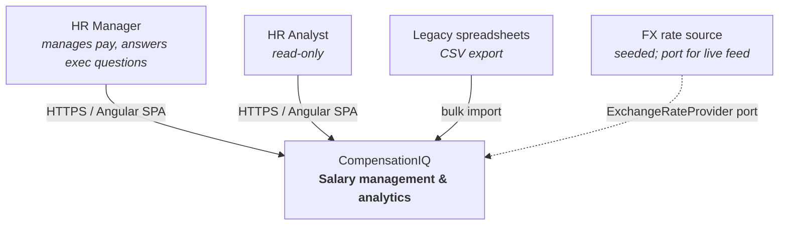
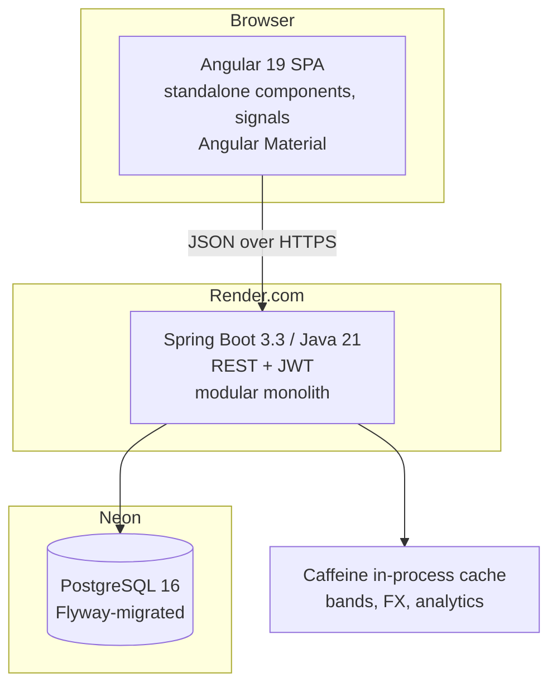
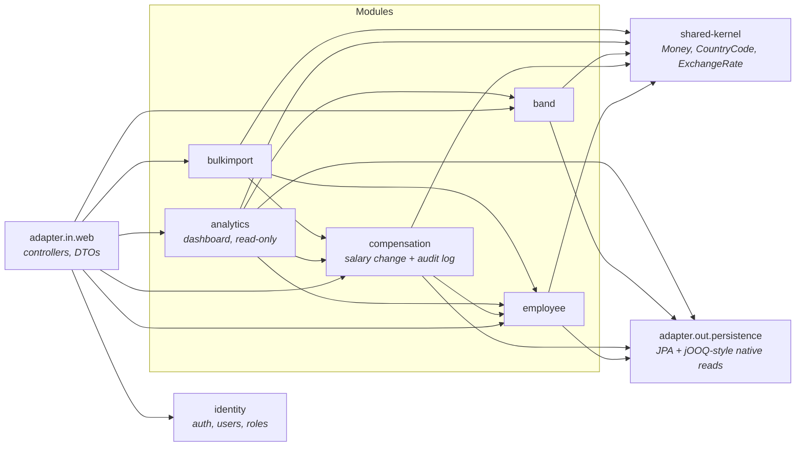
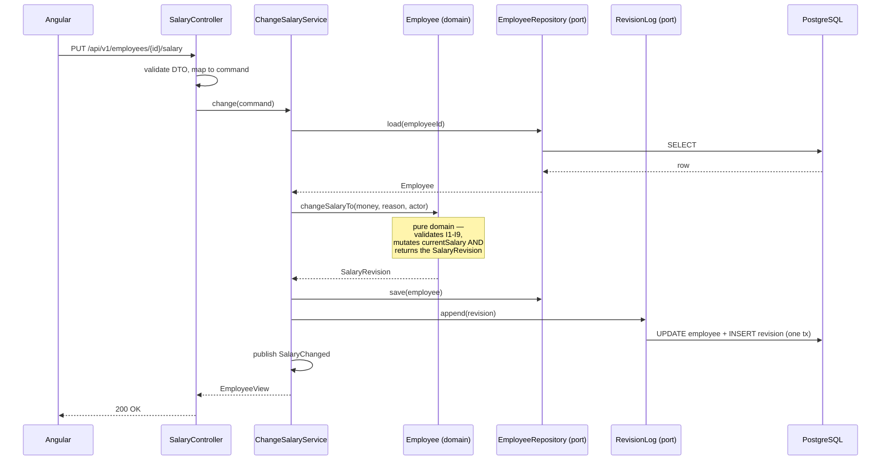

# Architecture

## 1. Shape: modular monolith, hexagonal inside each module

One deployable Spring Boot artifact. Inside it, four business modules with enforced boundaries,
each structured as ports-and-adapters.

**Why not microservices.** The assessment asks for good engineering judgment, and the judgment here is
that a single team building one product for one org with a 120k-row dataset gets nothing from network
boundaries except latency, distributed transactions and an ops burden. What we *do* need is the
ability to split later if the org grows — which is what module boundaries buy, at a fraction of the
cost. [ADR-0001](adr/0001-modular-monolith.md) records this in full, including the trigger conditions
that would justify splitting.

## 2. C4 Level 1 — Context



## 3. C4 Level 2 — Containers



Deliberately **no Redis, no message broker, no separate worker** in v1. Each would be a container to
run, secure and explain, for a dataset that fits comfortably in one process's cache.
[06-SCALABILITY.md](06-SCALABILITY.md) states the exact thresholds at which each earns its place.

## 4. C4 Level 3 — Modules and their dependencies



Rules, all enforced by ArchUnit tests in `ArchitectureTest.java`:

1. `domain` depends on nothing but `shared-kernel` and the JDK. No Spring, no JPA, no Jackson.
2. `application` depends on `domain` and on **ports** only — never on an adapter.
3. Adapters depend inward. Nothing depends on an adapter.
4. Modules talk to each other only through the other module's `application` port interfaces,
   never by reaching into its `domain` or `persistence`.
5. No cycles between modules.
6. `analytics` is read-only: it may not depend on any write port.

A build that violates these fails. That is the difference between an architecture and a diagram.

## 5. Package layout

```
com.acme.compiq
├── shared/                       # Money, CountryCode, CurrencyCode, ExchangeRate, DomainException
├── employee/
│   ├── domain/                   # Employee, EmployeeNumber, EmploymentStatus
│   ├── application/
│   │   ├── port/in/              # OnboardEmployeeUseCase, SearchEmployeesQuery
│   │   ├── port/out/             # EmployeeRepository (interface, defined HERE not in persistence)
│   │   └── service/              # implementations
│   └── adapter/
│       ├── in/web/               # EmployeeController, request/response records
│       └── out/persistence/      # EmployeeJpaEntity, EmployeeRepositoryAdapter, Spring Data iface
├── compensation/                 # salary change use case + append-only revision log
├── band/
├── analytics/                    # read-only dashboard; native SQL projections, no entities
├── bulkimport/
├── identity/
└── config/                       # Spring wiring, SecurityConfig, CacheConfig, OpenApiConfig
```

The **ports are owned by the application layer**, not by the adapter. `EmployeeRepository` is an
interface in `employee/application/port/out/` that the persistence adapter implements. That
inversion is what makes the domain testable without a database, and it's the detail most
"hexagonal" codebases get backwards.

## 6. Request flow, end to end



Note what the controller does *not* do: no business rules, no repository calls, no entity handling.
And note that `Employee.changeSalaryTo()` — where the rule lives — takes no dependencies and can be
tested with a plain JUnit test in microseconds. It returns the `SalaryRevision` rather than writing
it, so the audit guarantee is a property of the domain object, not of remembering to call something.

## 7. Read model vs write model

Writes go through JPA entities and the domain. **Analytics reads bypass JPA entirely** and use
hand-written native SQL returning flat projection records.

Reason: the KPI cards aggregate 10,000 employee rows across six currencies with FX conversion, and
the distribution charts need `percentile_cont`. That is a SQL problem, not an object-graph problem.
Loading entities to sum them in Java is the single most common performance mistake in Spring
applications, and Incubyte's point 10 asks specifically to see JPA query performance handled well.
This is a deliberate, documented CQRS-lite split — [ADR-0005](adr/0005-native-sql-for-analytics.md) —
not an accident.

## 8. Frontend architecture (Angular 19)

```
src/app/
├── core/          # auth interceptor, error interceptor, api base, guards
├── shared/        # money pipe, band-position chip, data-table, empty/error states
└── features/
    ├── employees/     # list (virtual scroll + server pagination), detail, revision log
    ├── compensation/  # change-salary dialog
    ├── bands/
    └── dashboard/     # KPI cards, filters, charts — the product's differentiator
```

- **Standalone components** throughout; no NgModules.
- **Signals** for component state; `httpResource`/`toSignal` for server state. No NgRx —
  this app has little cross-cutting client state and a store would be ceremony.
  ([ADR-0008](adr/0008-signals-over-ngrx.md).)
- One **facade service per feature**: components never call `HttpClient` directly.
- Strict TypeScript, `strictTemplates`, no `any`.
- Currency and dates formatted through shared pipes so nothing is hand-concatenated.

## 9. Cross-cutting

| Concern | Approach |
|---|---|
| Errors | RFC 7807 `application/problem+json` via `@RestControllerAdvice`. Domain exceptions map to 4xx; everything else is a 500 with a correlation ID and no internals leaked. |
| Validation | Bean Validation at the DTO edge for shape; domain invariants inside the domain. Two different jobs, deliberately not merged. |
| Observability | Micrometer + Actuator, `/actuator/health` and `/prometheus`. Structured JSON logs with a per-request correlation ID. Timers on every use case. |
| Config | 12-factor. No secrets in the repo. Profiles: `local`, `test`, `prod`. |
| API versioning | `/api/v1` from day one. |
| Migrations | Flyway, forward-only, every change reviewable as SQL. |
