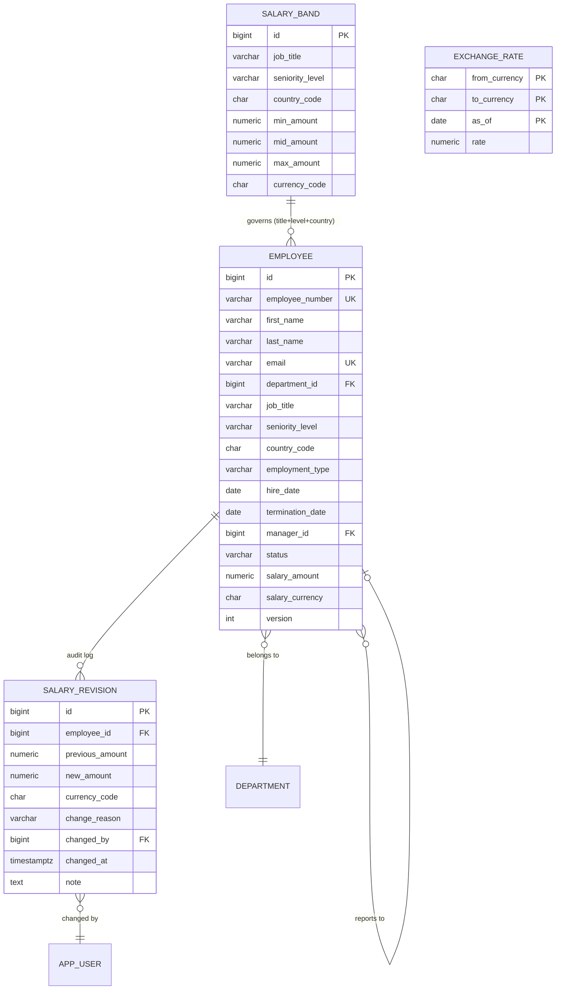

# Data Model

PostgreSQL 16, Flyway forward-only migrations. Incubyte asked specifically to see server-side
pagination, indexing, efficient filtered search and JPA query performance demonstrated against
10,000 records — so this document is largely about how each of those is made real, and the
`EXPLAIN` plans that prove it are committed in `docs/perf/`.

## 1. ERD



Salary lives on `employee` as `numeric(15,2)` + `char(3)`, mapped to the `Money` value object as a
JPA `@Embeddable`. `salary_revision` is insert-only: no update path exists in the repository, and
the application user has no `UPDATE`/`DELETE` grant on it.

## 2. Why `numeric`, and why the currency travels with it

`numeric(15,2)`, never `float8`. Exact decimal arithmetic is not optional for pay data, and
PostgreSQL sums `numeric` exactly.

The currency column sits immediately beside every amount column — on the employee, on the revision,
on the band. There is no "default currency" anywhere in the schema, because a default is how a
₹1,200,000 salary silently becomes $1,200,000 in a total.

## 3. Indexes, and the reasoning for each

The directory is the screen the HR Manager lives in: 10,000 rows, filtered by department, country,
level and status, free-text searched by name, sorted, and paged.

```sql
-- Directory filtering. Covering, so the common page is an index-only scan.
CREATE INDEX ix_employee_filter
  ON employee (status, department_id, country_code, seniority_level)
  INCLUDE (last_name, first_name, job_title, salary_amount, salary_currency);

-- Keyset pagination: the sort key must be a total order.
CREATE INDEX ix_employee_keyset ON employee (last_name, id);

-- Free-text name/email search without a leading-wildcard seq scan.
CREATE EXTENSION IF NOT EXISTS pg_trgm;
CREATE INDEX ix_employee_search_trgm
  ON employee USING gin ((first_name || ' ' || last_name || ' ' || email) gin_trgm_ops);

-- Aggregations for the dashboard, grouped and filtered on the same columns.
CREATE INDEX ix_employee_rollup
  ON employee (department_id, country_code, seniority_level)
  INCLUDE (salary_amount, salary_currency) WHERE status = 'ACTIVE';

-- Employee's own audit log, newest first.
CREATE INDEX ix_revision_employee ON salary_revision (employee_id, changed_at DESC);

-- Band matching.
CREATE UNIQUE INDEX ux_band_key ON salary_band (job_title, seniority_level, country_code);

-- Dated rate lookup.
CREATE INDEX ix_fx_lookup ON exchange_rate (from_currency, to_currency, as_of DESC);
```

The trigram index is the one worth pointing at in review: `WHERE name ILIKE '%mane%'` cannot use a
B-tree at all, and on 10,000 rows a sequential scan is *fast enough to hide the mistake* — which is
exactly why it is the kind of thing that ships and then falls over at 500,000.

## 4. Query patterns

**Filtered, searched, keyset-paged directory** — one query, no N+1, no `COUNT(*)`:

```sql
SELECT e.id, e.employee_number, e.first_name, e.last_name, e.job_title,
       e.seniority_level, e.country_code, e.salary_amount, e.salary_currency
FROM   employee e
WHERE  e.status = 'ACTIVE'
  AND (e.department_id = :dept          OR :dept IS NULL)
  AND (e.country_code  = :country       OR :country IS NULL)
  AND (:q IS NULL OR (e.first_name||' '||e.last_name||' '||e.email) ILIKE '%'||:q||'%')
  AND (e.last_name, e.id) > (:lastName, :lastId)
ORDER BY e.last_name, e.id
LIMIT  50;
```

**KPI cards — total spend, headcount, average and median, normalised to USD in one pass:**

```sql
WITH normalised AS (
  SELECT e.id,
         e.salary_amount * COALESCE(fx.rate, 1) AS usd_amount
  FROM   employee e
  LEFT JOIN exchange_rate fx
         ON fx.from_currency = e.salary_currency
        AND fx.to_currency   = :base
        AND fx.as_of         = :rateDate
  WHERE  e.status = 'ACTIVE'
    AND (e.department_id = :dept OR :dept IS NULL)
)
SELECT count(*)                                            AS headcount,
       sum(usd_amount)                                     AS total_spend,
       avg(usd_amount)                                     AS average,
       percentile_cont(0.5) WITHIN GROUP (ORDER BY usd_amount) AS median
FROM   normalised;
```

Four KPI cards, one round trip. Computing these in Java would mean pulling 10,000 rows into the JVM
to add them up — the single most common performance mistake in Spring applications, and the one
Incubyte's point 10 is asking to see avoided.

**Distribution by role** — `percentile_cont` for p25/p50/p75/p90 grouped by job title.

**Band position** — `employee JOIN salary_band` on (title, level, country), returning
`salary_amount / mid_amount` as a sortable column.

Each of these has an integration test asserting both the result and that `EXPLAIN` shows an index
scan rather than a sequential scan.

## 5. Pagination: keyset, not OFFSET

`OFFSET 9950 LIMIT 50` makes PostgreSQL read and discard 9,950 rows, degrades linearly, and skips or
duplicates rows when data changes between pages. Keyset reads exactly 50 rows at any depth and is
stable under concurrent writes. The API exposes an opaque `cursor`, not a page number, and totals are
approximate from `pg_class.reltuples` rather than an exact `COUNT(*)` on every page.
[ADR-0004](adr/0004-keyset-pagination.md).

## 6. Seeding

`SeedDataGenerator`, a Spring Boot CLI profile rather than a SQL dump:

- 10,000 employees across 8 departments, 6 countries (IN, US, DE, GB, SG, AU), 5 seniority levels
- salaries drawn from a plausible distribution per (role × level × country), in local currency
- ~30,000 salary revisions so the audit log is non-trivial and the directory has history to show
- ~180 salary bands and a seeded FX table
- **deterministic** — fixed RNG seed, so the demo, the tests and the load test see identical data

JDBC batch inserts with `rewriteBatchedStatements=true`; target under 20 s. Loading 10,000 entities
through Hibernate would take minutes and demonstrate exactly the instinct this document is arguing
against.
